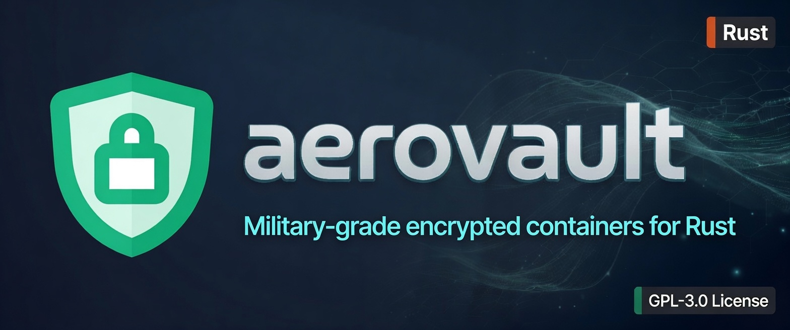
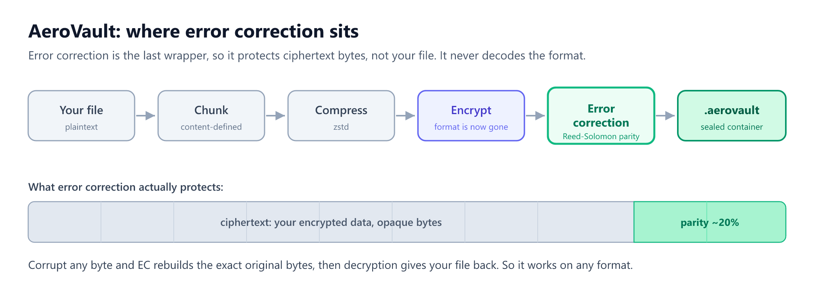
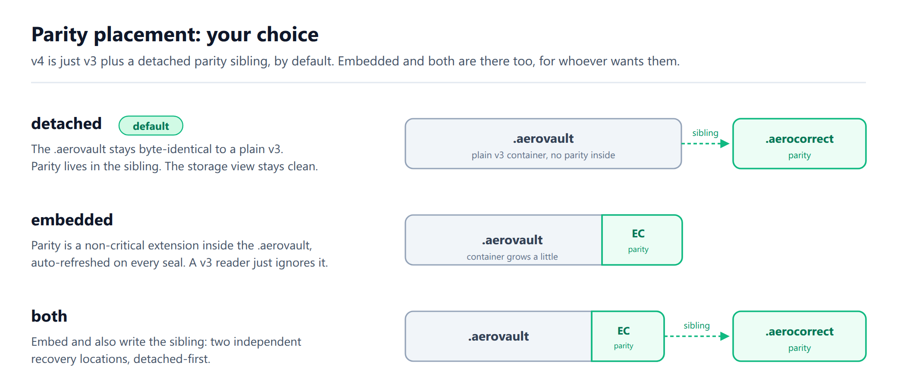
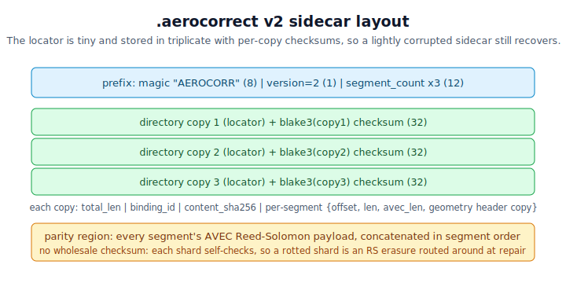
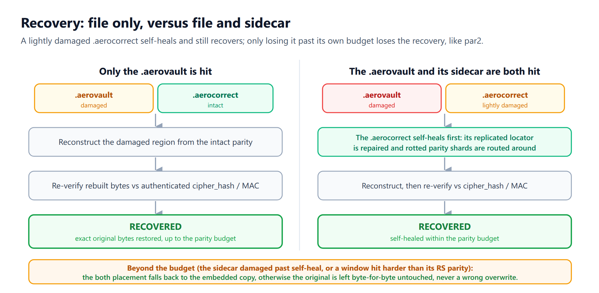

<p align="center">
  
</p>

# AeroVault

[](https://crates.io/crates/aerovault)
[](https://docs.rs/aerovault)
[](LICENSE)

Military-grade encrypted vault format for single-file encrypted containers.

AeroVault combines **AES-256-GCM-SIV** (nonce misuse-resistant), **Argon2id** (128 MiB), **AES-256-KW** key wrapping, and optional **ChaCha20-Poly1305** cascade encryption into a portable `.aerovault` file format.

The current container format is **v3**, which binds a per-file 16-byte `file_id` into the chunk AAD to prevent chunk splicing and reordering. Existing **v2** containers stay fully supported (read, write, and in-place re-encrypt); the crypto stack below is shared by both.

Since 0.5.0 the crate also ships the unified `.aerocorrect` Reed-Solomon sidecar format: a detached, content-SHA-bound recovery file for any byte stream. It can protect `.aerovault` containers or ordinary files, repair is atomic and all-or-nothing, and the **format v2 sidecar is self-healing** so a lightly-corrupted recovery file still recovers. See [Error Correction](#error-correction-aerocorrect) below.

## Cryptographic Stack

| Layer | Algorithm | Standard |
|-------|-----------|----------|
| KDF | Argon2id (128 MiB, t=4, p=4) | RFC 9106 |
| Key Wrapping | AES-256-KW | RFC 3394 |
| Content Encryption | AES-256-GCM-SIV | RFC 8452 |
| Cascade Mode | ChaCha20-Poly1305 | RFC 8439 |
| Filename Encryption | AES-256-SIV | RFC 5297 |
| Header Integrity | HMAC-SHA512 | RFC 2104 |
| Key Separation | HKDF-SHA256 | RFC 5869 |
| Error Correction | Reed-Solomon parity sidecar | `.aerocorrect` v2 (self-healing) |

## Installation

### From source

```bash
cargo install --path aerovault-cli
```

### From crates.io

Both crates are published on crates.io:

- Library: [crates.io/crates/aerovault](https://crates.io/crates/aerovault) - [docs.rs/aerovault](https://docs.rs/aerovault)
- CLI: [crates.io/crates/aerovault-cli](https://crates.io/crates/aerovault-cli)

```bash
# Add the library to your project
cargo add aerovault

# Or install the CLI
cargo install aerovault-cli
```

## CLI Usage

```bash
# Create a new vault
aerovault create my-vault.aerovault

# Create with cascade encryption (AES-GCM-SIV + ChaCha20-Poly1305)
aerovault create my-vault.aerovault --cascade

# Add files
aerovault add my-vault.aerovault file1.pdf file2.jpg

# Add files to a directory
aerovault add my-vault.aerovault document.pdf --dir docs/reports

# List contents
aerovault list my-vault.aerovault -H

# Extract a specific file
aerovault extract my-vault.aerovault -e document.pdf -o /tmp/output/

# Extract all
aerovault extract my-vault.aerovault -o /tmp/output/

# Create directories
aerovault mkdir my-vault.aerovault docs/reports

# Delete an entry
aerovault rm my-vault.aerovault document.pdf

# Rename an entry in place
aerovault rename my-vault.aerovault docs/report.txt report-final.txt

# Move or rename across directories
aerovault move my-vault.aerovault docs/report-final.txt archive/reports/report-final.txt

# Copy file or directory to another path
aerovault copy my-vault.aerovault archive/reports/report-final.txt backup/report-final.txt

# Show security info
aerovault info my-vault.aerovault

# Change password
aerovault passwd my-vault.aerovault

# Check if file is an AeroVault
aerovault check suspicious-file.bin

# Generate a detached recovery sidecar for any file
aerovault correct gen my-vault.aerovault --ec medium

# Verify without modifying the file
aerovault correct verify my-vault.aerovault

# Repair in place from my-vault.aerovault.aerocorrect
aerovault correct repair my-vault.aerovault
```

## Library Usage

```rust
use aerovault::{Vault, CreateOptions, EncryptionMode};

// Create a new vault
let opts = CreateOptions::new("secure.aerovault", "strong-password")
    .with_mode(EncryptionMode::Cascade);
let vault = Vault::create(opts)?;

// Add files
vault.add_files(&["secret.pdf", "keys.txt"])?;

// Open and list
let vault = Vault::open("secure.aerovault", "strong-password")?;
for entry in vault.list()? {
    println!("{} ({} bytes)", entry.name, entry.size);
}

// Extract
vault.extract("secret.pdf", "/tmp/")?;

// Rename in place (same parent directory)
vault.rename_entry("keys.txt", "keys-2026.txt")?;

// Move (works for files and directories)
vault.move_entry("secret.pdf", "archive/secret.pdf")?;

// Copy (works for files and directories)
vault.copy_entry("archive/secret.pdf", "backup/secret.pdf")?;
```

### Error Correction API

```rust
use aerovault::{correct_generate, correct_repair, correct_verify};

fn protect_and_repair() -> Result<(), Box<dyn std::error::Error>> {
    let report = correct_generate("my-vault.aerovault", 15, None)?;
    println!("wrote {}", report.sidecar);

    let verified = correct_verify("my-vault.aerovault", None)?;
    if !verified.verified {
        let repaired = correct_repair("my-vault.aerovault", None)?;
        println!("status: {}", repaired.status);
    }
    Ok(())
}
```

## Format Specification

The current version is **v4 = v3 container + Error Correction**. See [docs/AEROVAULT-V3-SPEC.md](docs/AEROVAULT-V3-SPEC.md) for the full v3 container specification (header, wrapper pipeline, manifest, extension directory, cryptography matrix) and the v4 Error Correction layer that rides on top of it. v4 is not a new on-disk major: the container stays v3 (magic `AEROVAULT3`, `format = 3`) and a plain v3 reader still opens a v4 container, skipping the non-critical Error Correction extension. The base binary layout that v3 builds on is in [docs/AEROVAULT-V2-SPEC.md](docs/AEROVAULT-V2-SPEC.md), and the detached recovery sidecar is in [docs/AEROCORRECT-SPEC.md](docs/AEROCORRECT-SPEC.md). See the [CHANGELOG](CHANGELOG.md) (0.4.0, 0.5.0) for the v3 and `.aerocorrect` deltas.

## Error Correction (`.aerocorrect`)

`.aerocorrect` is a detached, par2-style Reed-Solomon recovery sidecar for **any** byte stream. It protects the bytes of the target without embedding anything into it, so the same format repairs `.aerovault` containers, synced files, or ordinary standalone files. The sidecar binds to the **SHA-256 of the protected content**, not to a path, salt, account, or provider identity.

<p align="center">
  
</p>

Error correction is the **last wrapper** in the AeroVault stack, so it protects the ciphertext bytes and never has to decode the format. For a `.aerovault` the parity lives in a sibling file by default, so the container stays byte-identical to a plain v3.

<p align="center">
  
</p>

### CLI

```bash
# Generate a detached recovery sidecar (writes report.bin.aerocorrect)
$ aerovault correct gen report.bin --ec medium
Wrote report.bin.aerocorrect (31543 bytes, 1 segment(s), 15 shards, 15.5% overhead) for report.bin

# Verify without modifying the file
$ aerovault correct verify report.bin
Verified: report.bin matches report.bin.aerocorrect

# ...after a 4 KiB run in report.bin is overwritten with zeros...
$ aerovault correct verify report.bin
Corruption detected in report.bin: run `correct repair` to recover from report.bin.aerocorrect

# Repair in place from the sidecar
$ aerovault correct repair report.bin
Repaired report.bin from report.bin.aerocorrect (1 shard(s) reconstructed)

$ aerovault correct verify report.bin
Verified: report.bin matches report.bin.aerocorrect
```

### Overhead levels

CLI levels map to storage-overhead targets; the exact Reed-Solomon grid is stored in each payload, so readers reconstruct from the payload metadata rather than from a CLI-level assumption.

| Level | Target overhead | Reed-Solomon grid |
|-------|-----------------|-------------------|
| `low` | ~7% | approx `K=14, P=1` |
| `medium` | ~15% | approx `K=13, P=2` |
| `quartile` | ~25% | `K=8, P=2` |
| `high` | ~30% | approx `K=7, P=2` |
| numeric | 5-50% | clamped into the supported range |

### Self-healing (format v2)

The small metadata that *locates* everything (the segment directory, content hash, and per-window geometry) is stored in **triplicate with per-copy checksums**, so a lightly-corrupted sidecar still recovers: a single rotted directory copy is detected and the read falls back to a good copy. The bulk parity carries no wholesale envelope checksum; every Reed-Solomon shard already carries its own checksum, so a rotted parity shard is treated as an erasure and routed around at repair time. (The pre-v2 framing used an all-or-nothing checksum that rejected any flip; v2 sidecars are written today, v1 sidecars are still read.)

<p align="center">
  
</p>

<p align="center">
  
</p>

### Bounded memory

Generation and repair run in **64 MiB windows** and read sidecar parity on demand, so memory is bounded to one window plus that window's parity payload regardless of file size (the EC file cap is 1 GiB).

### Security model

Repair is **fail-closed and all-or-nothing**: the rebuilt stream is re-verified against the bound content hash (and, for a vault, its authenticated header MAC / manifest `cipher_hash`) **before** the original is replaced. A corrupt or foreign sidecar can therefore only make a repair *fail*, never overwrite good data. The atomic temp-and-rename write means a crash mid-repair never leaves a half-written original.

### Feature / version matrix

| Surface | Reads | Writes |
|---------|-------|--------|
| Vault container | v2, v3 | v3 |
| `.aerocorrect` sidecar | v1, v2 | v2 (self-healing) |

The `.aerocorrect` format is shared byte-for-byte with AeroFTP v4: a sidecar produced by either implementation verifies and repairs with the other for the same file and overhead level (a cross-implementation fixture pins this). See [docs/AEROCORRECT-SPEC.md](docs/AEROCORRECT-SPEC.md) for the full binary layout.

## vs Cryptomator

| | AeroVault | Cryptomator v8 |
|---|---|---|
| KDF | Argon2id (128 MiB) | scrypt (64 MiB) |
| Content cipher | AES-256-GCM-SIV | AES-256-GCM |
| Nonce misuse resistance | Yes | No |
| Cascade mode | Optional | No |
| Storage | Single file | Directory tree |
| Implementation | Rust | Java |

## Security

- All key material is zeroized after use
- Constant-time MAC comparison prevents timing attacks
- File-id-bound chunk AAD (current format) prevents chunk splicing and reordering
- Extraction opens outputs with `O_NOFOLLOW` + `create_new` to refuse symlink redirection
- Per-chunk lengths are bounds-checked before allocation
- `.aerocorrect` repair verifies the final SHA-256 before replacing the original
- Atomic writes prevent corruption on crash
- 128 MiB Argon2id makes GPU brute-force impractical

## License

GPL-3.0 -- See [LICENSE](LICENSE) for details.

## Origin

AeroVault was originally developed as the encryption engine for [AeroFTP](https://github.com/axpdev-lab/aeroftp), a professional FTP/SFTP/cloud client. This standalone crate makes the format available for any Rust project.

## Acknowledgements

From the v3 format work onward, the AeroVault wrapper-stack pipeline model (the
packing / chunking / chunk-id / compression / crypt / cipher-hash taxonomy) is a
design contribution by **Ehud Kirsh (E. Kirsh)**, AeroFTP issue
[#162](https://github.com/axpdev-lab/aeroftp/issues/162), 2026. Ehud has also
provided sustained community testing of AeroVault across releases. The
wrapper-stack format itself is implemented in the AeroFTP application; this crate
provides the stable v2 / current-format library it builds on.
